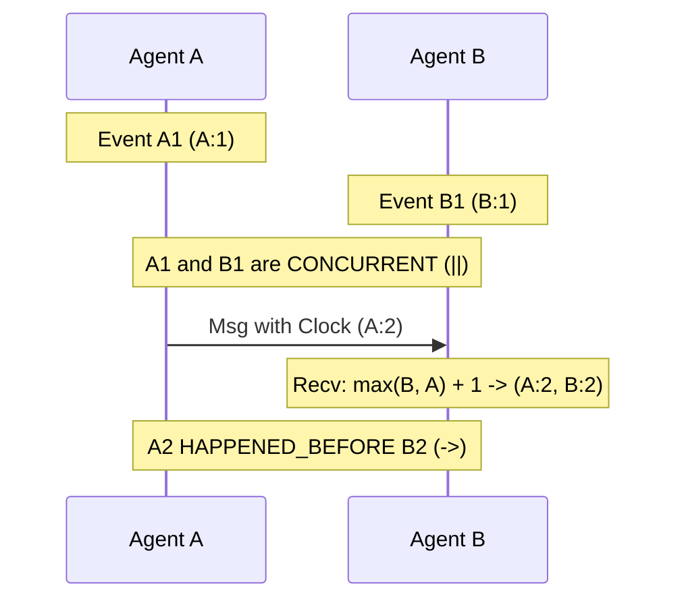

# GenPark Vector Clock Causality Tracker Skill

Vector clock and partial-order causal event tracking engine for distributed autonomous agents.

Explore more agentic technologies at [GenPark](https://genpark.ai) and the [GenPark MCP Catalog](https://genpark.ai/mcp).

## Features
- Complete vector clock causality engine with partial order detection (`->`, `||`, `==`).
- Zero external dependencies.
- Handles arbitrary number of asynchronous agents.
